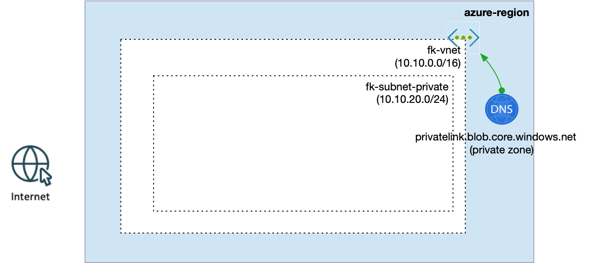
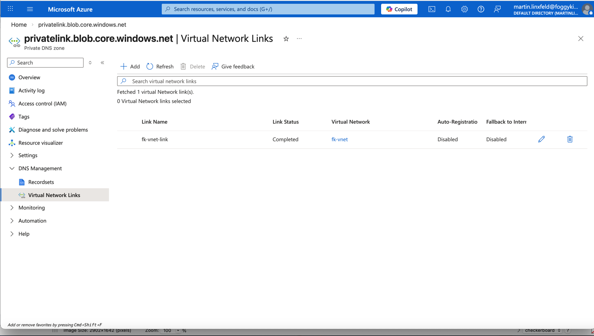
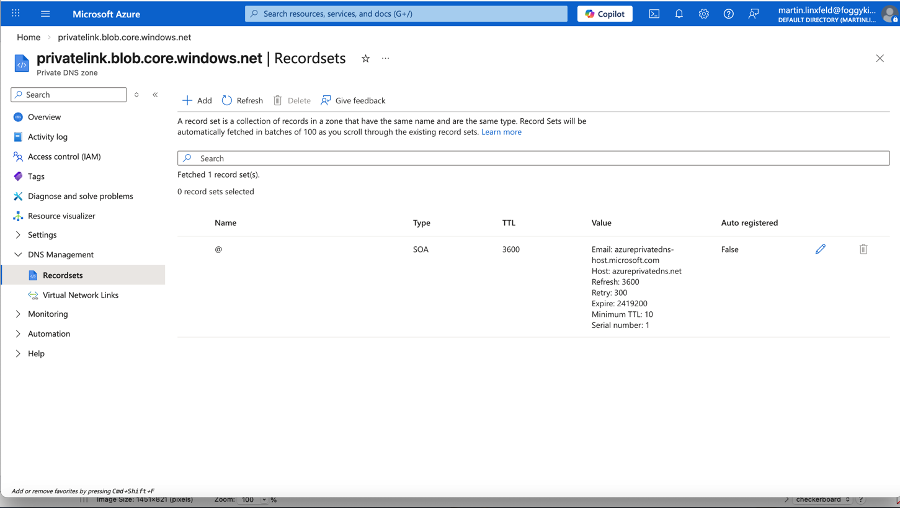

# Example 01: Private DNS Zone with VNet Link

This example creates a **Private DNS Zone** and links it to a **Virtual Network**.
It is the simplest possible building block for private DNS in Azure — and the
foundation for all private endpoint patterns.

---

## 🧭 Architecture Overview

This deployment creates:
- A **Virtual Network** via `terraform-az-fk-vnet`
- A **Private DNS Zone** via `terraform-az-fk-private-dns`
- A **VNet link** between the zone and the VNet



*Figure 1. Private DNS Zone linked to a VNet (no Private Endpoint yet).*

---

## 🖼️ Azure Portal View



*Figure 2. Private DNS Zone — Virtual Network Links view (VNet link created).*



*Figure 3. Private DNS Zone — Recordsets view (SOA record by default).*

---

## 🚀 Deployment Steps

From the `examples/01_private_dns_zone_with_vnet_link` directory:

```bash
tofu init
tofu plan
tofu apply
```

---

## 📤 Outputs

```bash
tofu output
```

- `private_dns_zone_id` — ID of the created Private DNS Zone
- `vnet_id` — ID of the linked VNet
- `vnet_link_ids` — map of VNet link IDs (keyed by `zone::link_name`)

---

## 🧹 Cleanup

```bash
tofu destroy
```

---

## 🪪 License

Licensed under the **Universal Permissive License (UPL), Version 1.0**.
